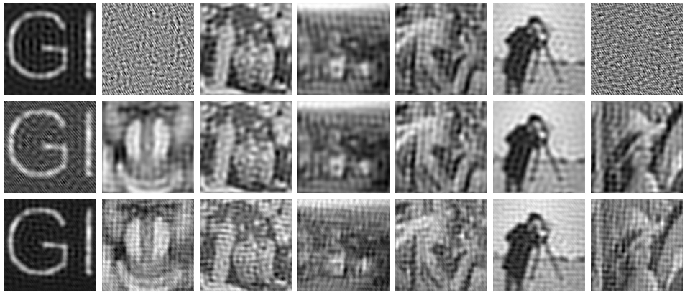
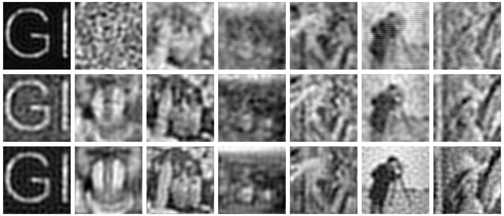
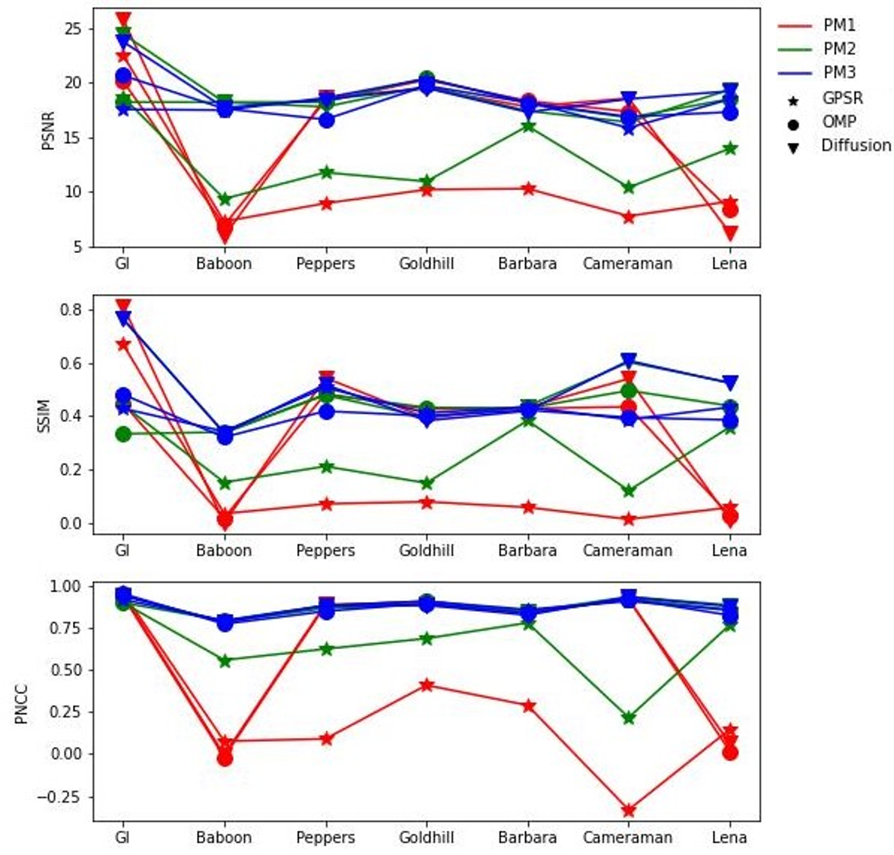
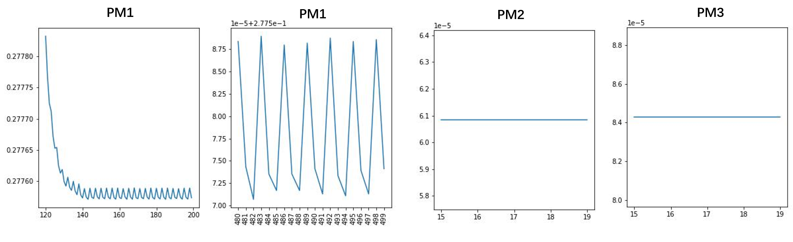

# Article Title

This repo contains visualization results for the paper XXXX. We also implemented **OPM** and **GPSR** algorithms using Pytorch as a comparison with Diffusion Model in [dm-mismatch](https://github.com/yanglebupt/dm-mismatch) repo.

by Le Yang (2019212184@bupt.edu.cn).

## Results

### Unknown Image Mismatch Reconstruction by Diffusion Model 


### Unknown Image Mismatch Reconstruction by OMP algorithm


### Unknown Image Mismatch Reconstruction by GPSR algorithm


### Comparison Curve


### Epoch-Error Curve


## Running

- `show.ipynb` file displays the results of the Diffusion model
- `cs_OMP.ipynb` file displays the results of the OMP algorithm
- `cs_GPSR.ipynb` file displays the results of the GPSR algorithm
- `evaluate.ipynb` file displays the curve chart of evaluation indicators for all reconstruction results

## Prerecovered Measurement Matrix
Download at [https://drive.google.com/drive/folders/1NbeVtzXnzTY1NOWK_IQwAi-4xc93X2mD?usp=drive_link](https://drive.google.com/drive/folders/1NbeVtzXnzTY1NOWK_IQwAi-4xc93X2mD?usp=drive_link) and place into `recvs` folder.


## Acknowledgement

GPSR algorithm is converted from MATLAB code in [http://www.lx.it.pt/~mtf/GPSR/](http://www.lx.it.pt/~mtf/GPSR/) website and referenced file is `GPSR_6.0/GPSR_Basic.m`.

## References

If you find the code/idea useful for your research, please consider citing

```bib
```
